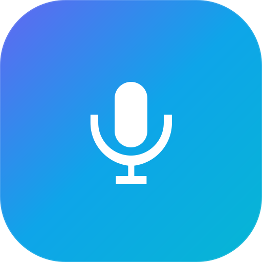

<div align="center">
  

  # Mac Meeting Transcriber

  *Your very own transcriber for every meeting*
</div>

A local meeting transcription app that captures microphone and Mac system audio using Apple Speech. Recording saves transcripts only; no summaries or Python AI models are required.

<div align="center">
  
</div>

<p align="center"><sub><i>Disclaimer: This is an independent open-source project for meeting-notes productivity and is not affiliated with, endorsed by, or associated with any similarly named company.</i></sub></p>

## Features

- Native Apple Speech transcription with microphone (`You`) and system audio (`Other`)
- Local transcript storage, search, copy, and meeting names
- Capture-ready feedback before the recording timer starts
- No Ollama, PyTorch, Whisper, or model-selection setup in the desktop app

## Startup performance

The recorder previously imported unused Whisper/PyTorch/Ollama packages on every process launch. Imports are now deferred out of the meeting path. A local entry-import check measured 1.27 seconds before and 0.08 seconds after; this measures Python imports, not total capture latency.

The fixed two-second start wait and five-second stop wait have been removed. The UI shows “Starting audio capture…” until the native helper confirms capture, and surfaces startup failures. The native helper build is reused when its inputs have not changed.

First use can still require macOS permissions and Apple Speech language assets. macOS 26 or newer is required. Existing meeting files remain readable; their historical `_summary.json` filenames contain transcript metadata and do not imply that a summary is generated.

## Installation

Download the latest release for your Mac:

- [Apple Silicon (M1/M2/M3/M4)](https://github.com/akashiitd/Mac_meeting_Transcriber_app/releases/latest/download/mac-meeting-transcriber-macos-arm64.dmg)
- [Intel Macs](https://github.com/akashiitd/Mac_meeting_Transcriber_app/releases/latest/download/mac-meeting-transcriber-macos-x64.dmg) Performance on Intel Macs is limited due to lack of dedicated AI inference capabilities on these older chips.

### Installing on macOS

1. **Download and open the DMG file**
2. **Drag the app to Applications**
3. **When you first launch the app**, macOS may show a security warning
4. **To fix this warning:**
   - Go to **System Settings > Privacy & Security** and click **"Open Anyway"**

   **Alternatively:**
   - Right-click Mac Meeting Transcriber in Applications and select **"Open"**
   - Or run in Terminal: `xattr -cr /Applications/Mac Meeting Transcriber.app`
5. **The app will work normally on subsequent launches**

You can run it locally as well (see below) if you dont want to install a dmg.

## Local Development/Use Locally

### Prerequisites
- macOS 26+
- Python 3.10+
- Node.js 18+
- Xcode 26+ or matching Command Line Tools for building the Apple Speech helper

### Setup
```bash
git clone https://github.com/akashiitd/Mac_meeting_Transcriber_app.git
cd Mac_meeting_Transcriber_app

# Backend
python3 -m venv venv
source venv/bin/activate
pip install -r requirements.txt

# Frontend
cd app
npm install
npm start
```

### Apple Speech live transcription

The `apple-speech` backend uses Apple's Speech framework (`SpeechAnalyzer` and `SpeechTranscriber`) and ScreenCaptureKit. It captures:

- `microphone` as `You`
- `system` audio as `Other`

On first use, macOS may request Microphone, Speech Recognition, and Screen & System Audio Recording permissions. If system audio capture is denied, enable it in **System Settings > Privacy & Security > Screen & System Audio Recording**, then restart Mac Meeting Transcriber.

### Build
```bash
cd app
npm run build
```

## Release Process

### Simple Release Commands
```bash
cd app

# Patch release (bug fixes): 0.0.5 → 0.0.6
npm version patch
git add package.json package-lock.json
git commit -m "Version bump to $(node -p "require('./package.json').version")"
git push
git tag v$(node -p "require('./package.json').version")
git push origin v$(node -p "require('./package.json').version")

# Minor release (new features): 0.0.6 → 0.1.0
npm version minor
git add package.json package-lock.json
git commit -m "Version bump to $(node -p "require('./package.json').version")"
git push
git tag v$(node -p "require('./package.json').version")
git push origin v$(node -p "require('./package.json').version")

# Major release (breaking changes): 0.0.6 → 1.0.0
npm version major
git add package.json package-lock.json
git commit -m "Version bump to $(node -p "require('./package.json').version")"
git push
git tag v$(node -p "require('./package.json').version")
git push origin v$(node -p "require('./package.json').version")
```

**What happens:**
1. `npm version` updates package.json and package-lock.json locally
2. Manual commit ensures version changes are saved to git
3. `git push` sends the version commit to GitHub
4. `git tag` creates the version tag locally
5. `git push origin tag` triggers GitHub Actions workflow
6. Workflow automatically builds DMGs for Intel & Apple Silicon
7. Creates GitHub release with downloadable assets

## Project Structure

```
mac-meeting-transcriber/
├── app/                  # Electron desktop app
├── src/                  # Python backend
├── website/              # Marketing site
├── recordings/           # Audio files
├── transcripts/          # Text output
└── output/              # Summaries
```

## Troubleshooting

### Debug Logs

Mac Meeting Transcriber includes a built-in debug panel for troubleshooting issues:

**In-App Debug Panel:**
1. Launch Mac Meeting Transcriber
2. Click the 🔨 hammer icon (next to settings)
3. The debug panel shows real-time logs of all operations

**Terminal Logging (Advanced):**
For detailed system-level logs, run the app from Terminal:
```bash
# Launch Mac Meeting Transcriber with full logging
/Applications/Mac Meeting Transcriber.app/Contents/MacOS/Mac Meeting Transcriber
```

This displays comprehensive logs including:
- Python subprocess output
- Apple Speech startup and transcription details
- Microphone and system audio capture errors
- HTTP requests and responses
- Error stack traces
- Performance timing

**System Console Logs:**
For system-level debugging:
```bash
# View recent Mac Meeting Transcriber-related logs
log show --last 10m --predicate 'process CONTAINS "Mac Meeting Transcriber"' --info

# Monitor live logs
log stream --predicate 'process CONTAINS "Mac Meeting Transcriber"' --level info
```

**Common Issues:**
- **Recording stops early**: Check microphone permissions and available disk space
- **"Capture failed to start"**: Check the native helper error and macOS microphone/system audio permissions
- **Empty transcripts**: Verify audio input levels and the selected microphone
- **Slow first recording**: macOS may need to prepare Speech assets; review the debug log for asset installation or permission requests

### Logs Location
- **User Data**: `~/Library/Application Support/mac-meeting-transcriber/`
- **Recordings**: `~/Library/Application Support/mac-meeting-transcriber/recordings/`
- **Transcripts**: `~/Library/Application Support/mac-meeting-transcriber/transcripts/`
- **Summaries**: `~/Library/Application Support/mac-meeting-transcriber/output/`

## License

**Mac Meeting Transcriber is free for personal, non-commercial use.**

CC BY-NC 4.0 (Creative Commons Attribution-NonCommercial 4.0 International)
